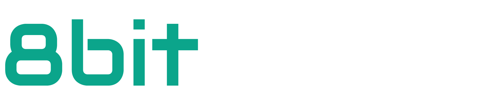
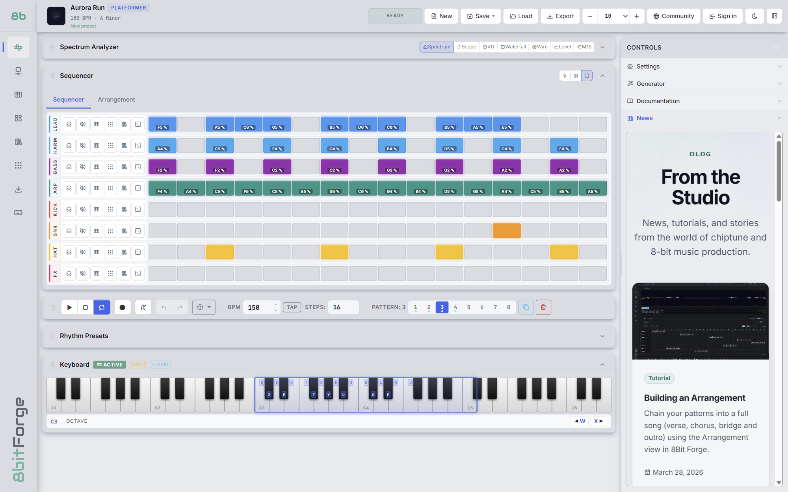
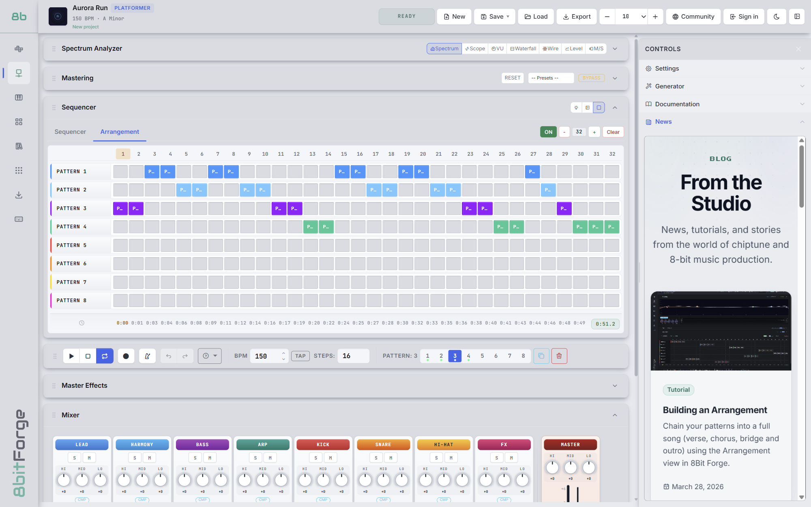
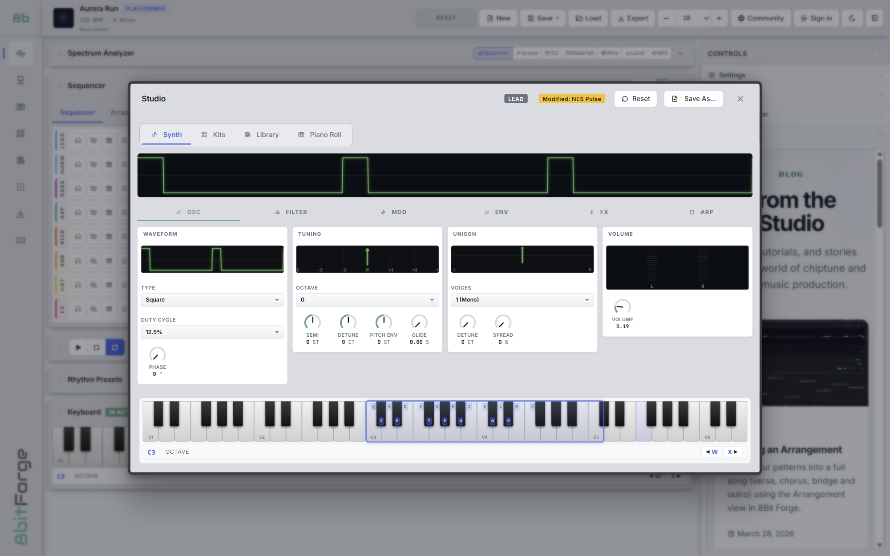
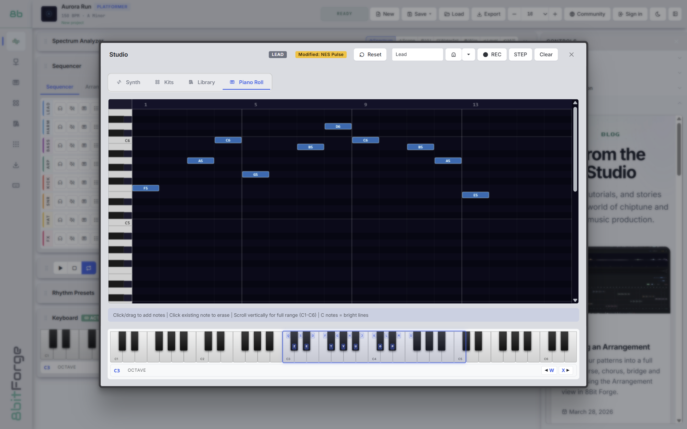
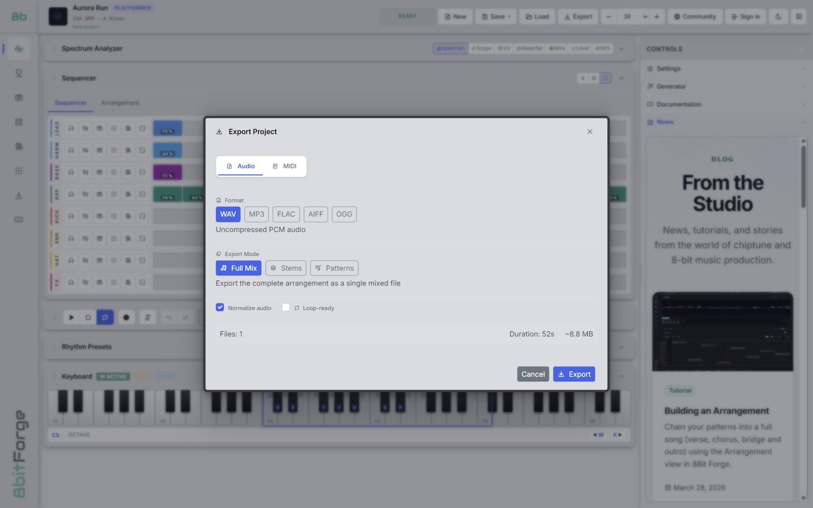

<p align="center">
  
</p>

<p align="center">
  <b>A free and open-source chiptune studio to compose 8-bit music for your games.</b><br>
  In the browser or on the desktop, offline, with nothing to sign up for.
</p>

<p align="center">
  <a href="https://studio.8bitforge.com"><b>Try it in the browser</b></a> ·
  <a href="https://8bitforge.com/en/download">Download</a> ·
  <a href="https://8bitforge.com">Website</a> ·
  <a href="LICENSE">AGPL-3.0</a>
</p>



## Features

- **8 tracks** (lead, harmony, bass, arp, kick, snare, hi-hat, FX), 8 patterns of up to 32 steps, and an **arrangement** view to build whole songs.
- **A synth per track**: square with pulse width, triangle, sawtooth, sine and noise, with envelopes, filters, LFOs, unison and an arpeggiator.
- **Piano roll**, step and real-time recording, computer keyboard or **MIDI** keyboard.
- **Mixer, master effects and mastering** (EQ and compressor), with FX and mixer automation.
- **A procedural generator**: music rules and a seeded random, to throw a starting idea at you. No AI involved.
- **100+ instruments and kits**, and demo songs to learn from.
- **Export** to WAV, MP3, OGG, FLAC, AIFF and MIDI: full mix, stems or patterns. For game engines, **loop points** in the file (`LOOPSTART` / `LOOPLENGTH` in OGG and FLAC, a `smpl` chunk in WAV), sample-accurate, with an intro that plays once before the loop.
- **The music is yours**: use it anywhere, commercial games included, no credit required.

## Screenshots

| | |
| --- | --- |
|  |  |
| **Arrangement**: chain patterns into a song | **Synth**: shape each track's sound |
|  |  |
| **Piano roll**: write melodies note by note | **Export**: audio or MIDI, ready for your engine |

## Get it

| Platform | How |
| --- | --- |
| **Browser** | [studio.8bitforge.com](https://studio.8bitforge.com), nothing to install |
| **Windows** | Installer or portable `.exe` on the [download page](https://8bitforge.com/en/download) |
| **Linux** | AppImage or `.deb` on the [download page](https://8bitforge.com/en/download), or `sudo snap install 8bitforge` |
| **macOS** | Coming soon |

The desktop builds are not code-signed yet, so Windows SmartScreen may warn you on the first launch. Every file on the download page comes with its SHA-256 checksum.

## Principles

- **Local first.** Projects, kits and presets live on your device. No account needed, and the studio works offline.
- **One codebase.** The same renderer runs in a browser and inside the desktop shell. Platform differences are isolated in `src/platform/`.
- **Online is optional.** An account is only needed to share creations with the community; signing in is by an emailed link or code, with no password.

## Development

Requires Node.js 20 or later.

On Windows, `run.bat` does everything: it installs the dependencies on first
run, then offers a menu (web app, desktop app, build, tests, lint). It also
takes the mode as an argument, for example `run.bat desktop`.

Otherwise:

```bash
npm install
npm run dev
```

Then open the URL Vite prints (default `http://localhost:5173`).

To run the desktop shell against the dev server:

```bash
npm run dev:desktop
```

### Scripts

| Command                 | What it does                                          |
| ----------------------- | ----------------------------------------------------- |
| `npm run dev`           | Vite dev server for the browser target                |
| `npm run dev:desktop`   | Dev server + Electron shell pointed at it             |
| `npm run build`         | Build the renderer into `dist/web`                    |
| `npm run start:desktop` | Build, then run the packaged renderer in Electron     |
| `npm run build:desktop` | Build installers into `release/` via electron-builder |
| `npm test`              | Run the test suite                                    |
| `npm run lint`          | Lint the whole repository                             |
| `npm run format`        | Format with Prettier                                  |

### Layout

```
apps/desktop/   Electron shell: main process, preload bridge, packaging
src/            The studio (shared by web and desktop)
  audio/        Synth engine, effects, mastering
  sequencer/    Patterns, arrangement, automation
  compose/      Generator, arpeggiator, instrument library
  export/       Audio and MIDI export
  core/         Event bus, configuration, feature flags
  platform/     File system and runtime abstraction, one file per target
  project/      .8bitforge file format, migrations, project session
  ui/           Interface
library/        Instruments, kits and demo songs that ship with the studio
assets/         Styles, fonts, icons
tests/          Unit tests
docs/           Architecture and file format documentation
```

`docs/architecture.md` explains how the pieces fit together.

### Project files

Projects are JSON with a `.8bitforge` extension, readable and diffable. Files
written by the legacy web app (format 1.x) open and are upgraded automatically.
See `docs/project-format.md`.

## Contributing

Bug reports, ideas and pull requests are welcome: see [CONTRIBUTING.md](CONTRIBUTING.md), or open an [issue](https://github.com/8binami/8bitforge-studio/issues).

## License

[GNU AGPL-3.0-or-later](LICENSE) © 8Binami

Use it, change it, share it. If you distribute a modified version you publish
your changes, and (this is what the Affero clause adds) **that includes
running one on a server people can reach**. A studio that anyone can host is
a studio anyone can fork into a service, and this is the licence that keeps
those forks open.

The music you make with 8BitForge is not covered by this licence: it is yours.
